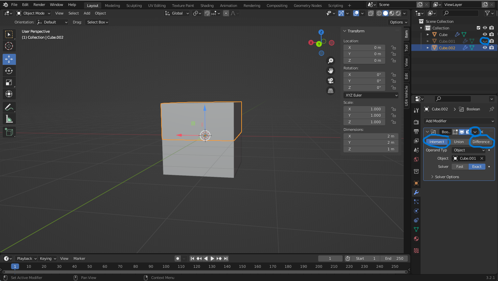
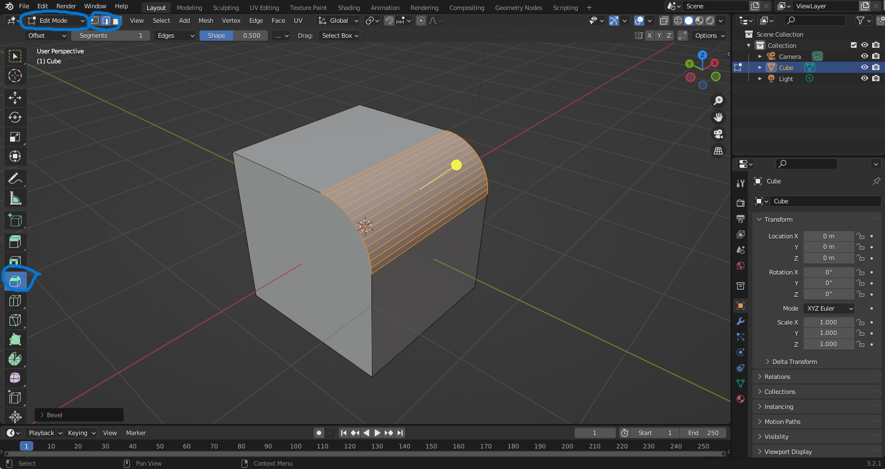

# Substraktive Box
1. Auf die Box ,von der substrahiert werden soll, drücken
1. Auf den Schraubenschlüssel gehen(rechts unten)
        
1. Modifier hinzufügen
1. Boolean auswählen
1. Modus "Difference
1. Auf die kleine Pipette neben objekt drücken damit dann auf die Box mit der man substrahieren
    will drücken
1. Mit "H" oder oben rechts die Substraktive Box ausblenden

# Objekt halbieren
1. Box Kopieren und an gleiche stelle einfügen
1. Eine Box erstellen die die hälfte abdeckt
1. Eine Box zu einer Substraktieven Box machen
1. Andere Box zu einer Intersect Box machen
1. Booleans(Substraktieve und Intersect) zuweisen
        
1. Substrektieve Box ausblenden

# Ecken abrunden
1. In den Edit Mode gehen
1. Bevel-Funktion auswählen
1. Oben links modus Edge mode auswählen
1. Ecken auswählen(Shift+linksklick)
1. Maus ziehen bis gewünschte fläche schräg ist
1. Mausrad drehen um abzurunden
        